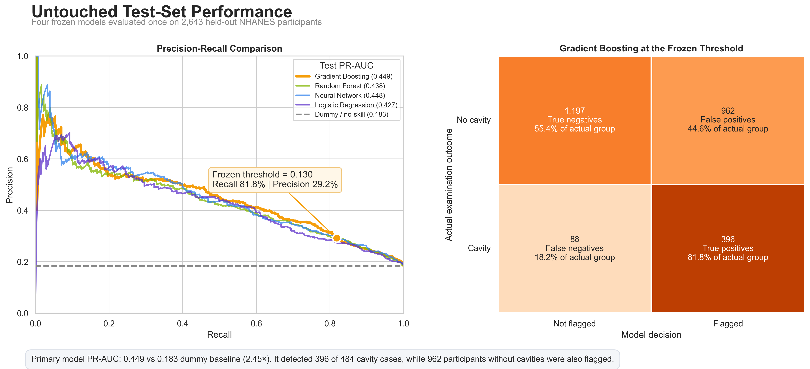

# Explainable Prediction of Untreated Dental Caries Using NHANES


[](LICENSE)

An end-to-end machine-learning project using NHANES examination and questionnaire data to predict whether a participant has untreated dental caries. The project follows the full workflow from raw public-health files to cohort construction, exploratory analysis, leakage-safe model development, untouched test-set evaluation, model interpretation, and subgroup reliability analysis.

**Tools:** Python, pandas, scikit-learn, SHAP, SciPy, Matplotlib, Seaborn, and Jupyter

The intended use is **questionnaire-based screening and referral prioritization before a dental examination**. The model is not a diagnostic system and does not replace an examination by a dental professional.

## Main Result

Gradient boosting was selected as the primary model using training data only. Its classification threshold was also fixed before the test set was opened, using an out-of-fold rule designed to support at least 80% recall.

On the untouched 2,643-participant test set, the primary model achieved:

- **0.449 PR-AUC**, compared with a **0.183 no-skill baseline**
- **0.776 ROC-AUC**
- **81.8% recall** (95% bootstrap interval: 78.2%–85.2%), detecting 396 of 484 cavity cases
- **29.2% precision** and **93.2% negative predictive value**
- 962 false-positive flags, reflecting the cost of prioritizing recall in a screening setting



*Gradient boosting achieved a test PR-AUC of 0.449 compared with the 0.183 no-skill baseline, approximately 2.45 times higher. At the frozen 0.130 screening threshold, it detected 396 of 484 cavity cases while also flagging 962 participants without cavities.*

## Project Question

Can untreated dental caries be predicted from information that could be available before a dental examination, including demographic characteristics, self-reported oral health, healthcare access, income, and diabetes status?

This project focuses on individual-level prediction rather than estimating national cavity prevalence. It also asks whether the final model is calibrated, which predictors drive its decisions, and whether its performance changes across age, sex, race/ethnicity, and income groups.

## Data and Cohort

The data come from the combined **2017–March 2020 pre-pandemic NHANES cycle**. Four public-use components are joined through the participant identifier `SEQN`:

| NHANES file | Component | Use in this project |
|---|---|---|
| [`P_OHXDEN.xpt`](https://wwwn.cdc.gov/Nchs/Data/Nhanes/Public/2017/DataFiles/P_OHXDEN.htm) | Oral Health Dentition Examination | Completed-exam status and untreated-caries target |
| [`P_DEMO.xpt`](https://wwwn.cdc.gov/Nchs/Data/Nhanes/Public/2017/DataFiles/P_DEMO.htm) | Demographics | Age, sex, race/ethnicity, and income-to-poverty ratio |
| [`P_OHQ.xpt`](https://wwwn.cdc.gov/Nchs/Data/Nhanes/Public/2017/DataFiles/P_OHQ.htm) | Oral Health Questionnaire | Dental-visit recency and self-rated teeth condition |
| [`P_DIQ.xpt`](https://wwwn.cdc.gov/Nchs/Data/Nhanes/Public/2017/DataFiles/P_DIQ.htm) | Diabetes Questionnaire | Diagnosed and borderline diabetes status |

The target, `has_cavity`, equals 1 when the dental examination contains an untreated-caries code (`K` or `Z`) in any of 28 evaluated tooth fields and 0 otherwise.

After retaining complete dental examinations and removing unusable questionnaire responses, the final analytic cohort contains:

| Cohort | Participants | Cavity cases | Prevalence |
|---|---:|---:|---:|
| Complete analytic cohort | 13,215 | 2,420 | 18.3% |
| Training set | 10,572 | 1,936 | 18.3% |
| Untouched test set | 2,643 | 484 | 18.3% |

The split is stratified by the target with `random_state=42`. Missing income is preserved with an explicit missingness indicator and is imputed inside the modeling pipeline rather than before the split or cross-validation.

## Predictors

The models use 13 features available before the dental examination:

- age and sex
- income-to-poverty ratio and an income-missingness indicator
- dental-visit recency
- self-rated teeth condition
- diagnosed and borderline diabetes indicators
- five race/ethnicity indicator variables

Race and ethnicity are treated as social and demographic variables, not biological mechanisms. Their inclusion is examined through sensitivity and subgroup analyses rather than interpreted causally.

## Modeling Approach

Four models are developed using the same stratified folds:

1. Logistic regression
2. Random forest
3. Gradient boosting
4. Multilayer perceptron neural network

All imputation, scaling, and model fitting occur inside scikit-learn pipelines. This keeps preprocessing inside each cross-validation fold and prevents information from the validation or test data from leaking into model development.

The development process uses:

- five-fold stratified cross-validation
- PR-AUC as the primary selection metric because cavities are the minority outcome
- out-of-fold predictions for threshold selection and calibration checks
- paired repeated cross-validation for the top-model comparison
- a Wilson-supported 80% recall-floor rule to select thresholds
- a permanent test set that remains untouched until Notebook 5
- 2,000 paired bootstrap resamples for test-set uncertainty and model comparisons

Gradient boosting and random forest were effectively tied during repeated cross-validation. Gradient boosting was pre-committed as the primary model because it also showed higher ROC-AUC, slightly better calibration, and better precision at the recall-floor operating point.

## Untouched Test-Set Results

| Model | Threshold | PR-AUC | ROC-AUC | Recall | Precision | NPV |
|---|---:|---:|---:|---:|---:|---:|
| **Gradient Boosting** | **0.130** | **0.449** | **0.776** | **0.818** | **0.292** | **0.932** |
| Random Forest | 0.130 | 0.438 | 0.767 | 0.837 | 0.288 | 0.936 |
| Neural Network | 0.115 | 0.448 | 0.771 | 0.845 | 0.281 | 0.937 |
| Logistic Regression | 0.125 | 0.427 | 0.758 | 0.839 | 0.271 | 0.932 |

All four models outperform the 0.183 prevalence-based PR-AUC reference. Their similar results also show that the main predictive signal does not depend on one algorithm.

The primary model's mean predicted probability is 0.182 compared with an observed test prevalence of 0.183. Its Brier score is 0.125, representing a 16.4% improvement over predicting the prevalence for everyone. The calibration intercept is 0.106 and the calibration slope is 1.076, which support reasonable but not perfect calibration.

## Interpretation and Reliability Findings

- **Self-rated teeth condition is the strongest predictor.** Grouped permutation decreases test PR-AUC by 0.185 when this feature is disrupted. Removing it reduces cross-validated PR-AUC from 0.430 to 0.352, showing that the model depends substantially on participants' awareness of their oral health.
- **Age, dental-visit recency, income, and race/ethnicity provide additional signal.** Removing race/ethnicity causes a smaller cross-validated PR-AUC change, from 0.430 to 0.423.
- **The fixed threshold behaves differently across groups.** Higher-income participants have lower average cavity risk, so the single 0.130 cutoff flags a smaller share of them, catching only 38.1% of their actual cavity cases. This is a threshold artifact, not a ranking problem: adjusting the cutoff so the same share of this group is flagged as in the overall test set raises recall to 83.3%, back in line with the model's overall performance.
- **Some differences cannot be solved by moving the threshold.** Within the non-Hispanic Asian subgroup, ROC-AUC is 0.631 and matched-share recall is 0.638, identifying a ranking limitation that requires external validation rather than a post-hoc cutoff change.
- **No subgroup-specific thresholds are adopted.** The subgroup analyses are diagnostic sensitivity checks. The original 0.130 threshold remains unchanged.

## Notebook Workflow

The notebooks are designed to be read and run in order:

| Notebook | Purpose |
|---|---|
| [1) Understanding the Data](notebooks/1%29%20Understanding%20the%20Data.ipynb) | Audits the raw NHANES files, variables, identifiers, and missingness |
| [2) Building the Dataset](notebooks/2%29%20Building%20the%20Dataset.ipynb) | Defines the cavity target, merges the four files, and creates the 13,215-person cohort |
| [3) Exploring the Data](notebooks/3%29%20Exploring%20the%20Data.ipynb) | Explores prevalence and predictor relationships, then creates the permanent training/test split |
| [4) Developing the Models](notebooks/4%29%20Developing%20the%20Models.ipynb) | Builds, tunes, calibrates, and compares four models using training data only |
| [5) Evaluating the Models](notebooks/5%29%20Evaluating%20the%20Models.ipynb) | Evaluates all frozen models and thresholds once on the untouched test set |
| [6) Interpreting the Models](notebooks/6%29%20Interpreting%20the%20Models.ipynb) | Uses coefficients, grouped permutation importance, SHAP, case explanations, and sensitivity analyses |
| [7) Examining Subgroup Performance](notebooks/7%29%20Examining%20Subgroup%20Performance.ipynb) | Examines the primary model across age, sex, race/ethnicity, and income groups |

## Repository Contents

| Path | Contents |
|---|---|
| `data/raw/` | Original NHANES XPT files |
| `data/processed/` | Final cohort and permanent training/test CSV files |
| `notebooks/` | Seven explanatory notebooks containing the complete workflow |
| `outputs/tables/` | Development, evaluation, interpretation, and subgroup result tables |
| `outputs/models/` | Reproducibility metadata; fitted model files are generated locally |
| `outputs/figures/` | The reproducible summary figure used in this README |

## Reproducing the Analysis

Clone the repository and create a Python environment:

```bash
git clone https://github.com/vp-360/Dental-Caries-Prediction-Project.git
cd Dental-Caries-Prediction-Project

python3 -m venv .venv
source .venv/bin/activate
python -m pip install --upgrade pip
pip install -r requirements.txt
jupyter notebook
```

On Windows, activate the environment with:

```powershell
.venv\Scripts\activate
```

Run the notebooks in numbered order. Notebook 4 creates the fitted `.joblib` pipelines used by Notebooks 5–7. These model files are intentionally excluded from Git because the complete preprocessing and fitting process is reproducible from the tracked data and notebooks.

Several safeguards support reproducibility:

- fixed random seeds for the train/test split, cross-validation, and bootstrap
- SHA-256 fingerprints for the training data, test data, fitted models, and prediction files
- saved metadata recording model parameters, thresholds, package versions, and artifact relationships
- assertions that check participant overlap, schema consistency, probability validity, and saved output integrity
- stored participant-level out-of-fold and test predictions for later analyses

The final saved metadata records NumPy 2.3.5, pandas 2.3.3, and scikit-learn 1.8.0.

## Limitations

- This is an internal holdout evaluation. The training and test participants come from the same NHANES cycle, so external or prospective validation is required before real-world use.
- NHANES survey weights, strata, and primary sampling units are not incorporated. Reported prevalence and subgroup results describe this analytic cohort and should not be interpreted as national estimates.
- The random train/test split does not account for geographic or primary-sampling-unit clustering.
- Self-rated teeth condition is appropriate for a pre-examination questionnaire, but in NHANES it was collected on the same day as the dental exam, so respondents may have already been noticing symptoms (pain, visible decay) at the time they answered. This risks partly circular signal: the rating may already reflect the exam outcome rather than genuinely predicting it ahead of time. If someone uses this tool well before any planned dental visit, their self-rating may be a weaker signal than it was in training, so real-world screening accuracy could be lower than the reported results.
- A low predicted probability cannot rule out untreated caries, and the model's high-recall threshold produces many false-positive referrals.
- Subgroup analyses are exploratory, use ordinary participant-level bootstrap intervals, and do not prove fairness, causation, or suitability for subgroup-specific thresholds.
- The available predictors do not include every behavioral, clinical, environmental, or access-related factor that may affect untreated caries.

## AI Assistance


I designed the project structure, chose the modeling approach, and wrote the initial
implementations. AI tools supported code review and helped identify analytical
refinements, which I evaluated and selectively implemented. I executed and verified
all notebooks and wrote the final interpretation.

## License

This project is available under the [MIT License](LICENSE).

## Author

Vedant Patil  
Rice University
